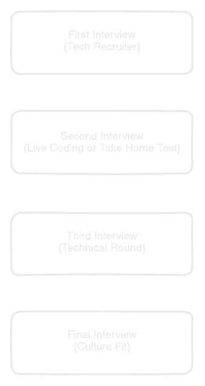

### ထိုင်းက အလုပ်အကိုင် အခွင့်အလမ်း
ထိုင်းမှာ Covid နောက်ပိုင်း IT သမားတွေ အခွင့်အလမ်း အရမ်းကောင်းလာပါတယ်။ ထိုင်းအစိုးရက သူတို့ IT Sector တိုးတက်အောင် နိုင်ငံတော်အဆင့် Strategy ချပြီးကို အကောင်အထည်ဖော်နေတာပါ။ အဓိကကတော့ ထိုင်းနိုင်ငံသားတွေ IT Sector မှာ ပိုပြီး တိုးတက်အောင် အတွေ့အကြုံရှိတဲ့ နိုင်ငံခြားသား Talent တွေကို ထိုင်းမှာ လာအလုပ်လုပ်ချင်အောင် အမျိုးမျိုးဆွဲဆောင်ထားပါတယ်။ အရင်က နိုင်ငံခြားသားကို ထိုင်းမှာအလုပ်ခန့်ချင်ရင် ထိုင်း ၄ ယောက်ခန့်ပြီးမှ နိုင်ငံခြားသား တယောက်ခန့်လို့ရပါတယ်။ အခုကတော့ BOI လို့ခေါ်တဲ့ [Board of Investment](https://www.boi.go.th/en/index/) ကို တည်ထောင်ပြီး Visa အသစ်တွေ ၃ ၄ မျိုး အသစ်ထုတ်ပြီး BOI Visa တွေ ထုတ်ပေးပါတယ်။ BOI အောက်က Company တွေက ထိုင်း ၄ ယောက် နိုင်ငံခြားသားတယောက် ဥပဒေကို လိုက်နာစရာမလိုတော့ပါဘူး။ BOI Company တွေ ပြန်လုပ်ပေးရတာကတော့ အလုပ်ခန့်လိုက်တဲ့ နိုင်ငံခြားသားက ထိုင်းနိုင်ငံကို ဘာတွေ အကျိုးအမြတ် ယူလာပေးမလဲ။ ထိုင်းနိုင်ငံသားတွေ အကျိုးရှိအောင် ဘာတွေ သင်ပေးနိုင်မလဲဆိုတာ BOI ကို ပြန်လည် တင်ပြရပါတယ်။​

Visa ထုတ်ပေးတာကို One-stop Service အနေနဲ့ တခါထဲ ပြီးအောင် ရုံးတစ်ခုထဲ ပေါင်းထားလိုက်ပါတယ်။ သာမန် Immigration ရုံးကိုတောင် သွားစရာမလိုဘဲ BOI Office မှာတင် တခါထဲပြီးစီးအောင် လုပ်ပေးထားတာပါ။ Master Degree နဲ့အထက် ရရှိထားသူတွေဆိုရင် [LTR Visa](https://thaievisa.go.th/visa/ltr-visa) လို့ခေါ်တဲ့ ၁၀ နှစ် သက်တမ်း Long-term Visa ကိုတောင် လျှောက်လို့ ရပါတယ်။ အဲ့ Visa မှာဆိုရင် 17% Flat Tax Benefit နဲ့ အခြား အခွင့်အရေးတွေ အများကြီး ရပါတယ်။

### လိုအပ်ချက်များ
ထိုင်းမှာ အလုပ်လုပ်မယ်ဆို Work Permit လိုပါတယ်။ Work Permit ကို အလုပ်ရရင် Company က လျှောက်ပေးပါတယ်။ Company ဆိုရာမှာ နှစ်မျိုး ရှိပါတယ်။ ထိုင်းလူမျိုးပိုင် Company ရယ် အရင်ရှင်းပြခဲ့သလို နိုင်ငံခြားသားပိုင် BOI Company ရယ်ဆိုပြီး ရှိတယ်။ 

ဒါဆို ဘယ်လို ခွဲရမလဲ။ BOI Company ဟုတ်မဟုတ် ဒီမှာ သွားစစ်ပါ။

[BOI Company Database](https://www.boi.go.th/index.php?page=form_promoted_companies&language=en)

မရှိရင် ထိုင်း Company ဖြစ်ဖို့ များပါတယ်။ တကယ် လုပ်နေတဲ့ Company တွေက LinkedIn Profile သေချာ ဆောက်ထားပါတယ်။ နောက်ခံ Background ကို သေချာလေ့လာပါ။ [Glassdoor](https://www.glassdoor.com/index.htm) မှာလဲ Review တွေ ကြည့်လို့ ရပါတယ်။ BOI Company ဖြစ်ဖြစ် ထိုင်း Company ဖြစ်ဖြစ် နိုင်ငံခြားသားကို ခန့်မယ်ဆိုရင် ဒီ Requirement တွေ လိုပါတယ်။

| Education | Years of Experience |
|:--|:--|
| IT ဘွဲ့ရ  | ၃ နှစ်အထက်|
| အခြားဘွဲ့ရ | ၅ နှစ်အထက် |
| ဘွဲ့မရ | ၅ နှစ်အထက် |

လုပ်သက်ကိုတော့ Certificate of Employeement ကို အရင် Company တွေကနေ Letter Head နဲ့ ယူပြီး ပြရပါတယ်။ Certificate of Employment ဆိုတာ Recommendation letter နဲ့ မတူပါ။

**Certificate of Employeement**

အလုပ်လုပ်ခဲ့ကြောင်း ရာထူးနှင့် အလုပ်စဝင်/နှုတ်ထွက်သော ရက်လနှစ်ကို Company letter Head နှင့် ဖော်ပြထား

**Recommendation Letter**

ယခင်အလုပ်မှ အထက်လူကြီးက အကျင့်စာရိတ္တ ကောင်းမွန်ကောင်း အလုပ်တာဝန်ကျေကြောင်း ထောက်ခံစာ

ဘွဲ့လက်မှတ်ကို Notary ပြန်ပြီး မြန်မာ MOFA (Ministry of Foreign Affairs) မှ တံဆိပ်တုံး ထုလာရင် ပိုကောင်းပါတယ်။ 

Internship Position များကတော့ အင်မတန်ပြောရခက်ပါတယ်။ ထိုင်းက တက္ကသိုလ်တွေကနေ ဘွဲ့ရသူ တချို့ကတော့ Internship ကို ခင်မင်ရင်းနှီးတဲ့ Company တွေဆီမှာ ဆင်းကြပါတယ်။​ မရတာများပါတယ်။ Junior position များကတော့ ထိုင်းတွေကိုသာ ခန့်တတ်တာမို့ နိုင်ငံခြားသားများ ရဖို့ မလွယ်ပါ။ နိုင်ငံခြားသားခန့်ရင် ပေးရတဲ့လစာက သတ်မှတ်ထားတဲ့ လစာနှုန်းထားဖြစ်တဲ့ ဘတ် ၅၀,၀၀၀ အောက်ကို မရောက်အောင် ပေးရတာမို့လို့ Junior position ကို ထိုင်းတွေကိုသာ ခန့်လိုက်တာများပါတယ်။

### အလုပ်ရှာမယ်

ထိုင်းမှာ အလုပ်ရှာမယ်ဆို အဓိက သုံးရမဲ့ Website ၃ ခု ရှိပါတယ်။

1. [LinkedIn](https://linkedin.com) ကတော့ ထိုင်းက Tech Recruiter တွေ အများဆုံး သုံးတဲ့ Website ပါ။ 
2. [JobsDB Thailand](https://th.jobsdb.com) ကတော့ အလုပ်ခေါ်စာတွေ​ ရှိပေမဲ့ Reply ပြန်တာ တော်တော် နည်းပါတယ်။ တချို့ Scammer တွေ CV Collect လုပ်ပြီး CV ထဲက ဖုန်းနံပတ်တွေကို Scam SMS တွေ ပို့ကြပါတယ်။ သတိထားဖို့ပါ။
3. [Indeed](https://th.indeed.com) မှာလဲ အလုပ်ခေါ်စာတွေ ရှိပေမဲ့ နည်းနည်းတော့​ ရှားပါတယ်။

အတော်များများက LinkedIn မှာကော ကျန်တဲ့ Website တွေမှာကော အလုပ်လိုက်လျှောက်တယ်။ CV တင်တယ်။ Interview တောင်မခေါ်ဘူးဆိုတာမျိုး ပြောကြပါတယ်။ တကယ်က မြန်မာမှာလို အလုပ်ခေါ်စာတွေမှာ CV လိုက်တင်ပြီး အလုပ်ရဖို့ မျှော်လင့်နေတယ်ဆိုရင်တော့ အမှားကြီး မှားပါမယ်။ ထိုင်းမှာ အဲ့လိုမျိုး မရပါဘူး။​ LinkedIn မှာ လက်ခံတဲ့ Professional ဆန်တဲ့ CV တစ်ခု ဘယ်လို တည်ဆောက်မလဲ၊ Professional Network တစ်ခု ဘယ်လို တည်ဆောက်မလဲဆိုတာ သီးသန့် Article တစ်ခုရေးပေးထားပါတယ်။

### Interview ခေါ်ပြီ
လျှောက်ထားတဲ့ အလုပ်တွေထဲက ကိုယ့်ကို သဘောကျလို့  Interview ခေါ်ပြီဆိုရင် ပုံမှန် အားဖြင့် အဆင့် ၃ ဆင့်လောက်ရှိပါတယ်။ Manager level ဆိုရင်တော့ ၄ ဆင့်လောက်ရှိတတ်ပါတယ်။

1. ပထမဆုံး Interview ရမှာက Tech Recruiter နဲ့ပါ။ ဒီအဆင့်မှာတော့ ကိုယ့် Background ကို အရင်မေးမယ်။ ဘာတွေ လုပ်ခဲ့ဖူးသလဲ စပ်စုပြီး ရှာနေတဲ့ Position နဲ့ ကိုက်မကိုက်ဆုံးဖြတ်ပါတယ်။ English လို မရှက်ဘဲ မိတ်ဆက်စကားပြောနိုင်ဖို့ ကိုယ်ဘာတွေလုပ်ခဲ့ဖူးသလဲ ကောင်းကောင်း ပြောနိုင်ဖို့ သေချာလေ့ကျင့်ထားဖို့ လိုပါတယ်။
2. အဆင့် ၂ မှာတော့ Live Coding Test သို့မဟုတ် Take Home Project အသေးစားတစ်ခုခု ပေးတာများပါတယ်။ Live Coding မှာတော့ Data Structure and Algorithm ကို သေချာ နားလည်မလည် Problem တစ်ခုပေးပြီး ရေးခိုင်းတာမျိုးပါ။ Code မဟုတ်ရင်တောင် Psudo-code ရေးခိုင်းပါတယ်။ အဓိက စစ်တာကတော့ ကိုယ်ရေးနေတဲ့ Code နားလည်မလည်၊ ကိုယ့် Team ကို ကိုယ်ဘာလုပ်နေလဲ Communication လုပ်တတ် မလုပ်တတ် စစ်ပါတယ်။ Live Coding Test အကြောင်း အသေးစိတ် သိချင်ရင် Live Coding Mock Test တွေ YouTube မှာ ရှာကြည့်ပါ။ Take Home Project တွေကတော့ Project အသေးစား တစ်ခုကို အချိန် အတိုင်းအတာ တစ်ခုပေးပြီး ရေးခိုင်းတာမျိုးပါ။ Test Case တွေ မပါရင် ကျဖို့ များပါတယ်။
3. ဒီအဆင့်ကတော့ Manager level သို့မဟုတ် Architect/Tech Lead level ဆိုရင် စစ်တတ်ပါတယ်။ အင်တာဗျူးမဲ့ Tech Team ကနေ Real-world Problem ပေးတာမျိုး သို့မဟုတ် အရင်က ကိုယ်ထုတ်ဖူးတဲ့ Solution ကို ရှင်းပြရတာမျိုးပါ။ English လို သေသေချာချာ​ရှင်းနိုင်ဖို့ လိုပါတယ်။ ကိုယ့် Idea ကို ရှင်းရှင်းလင်းလင်း ပြောနိုင်ရင် အတော်အဆင်ပြေပါပြီ။
4. နောက်ဆုံးအဆင့်ကတော့ Culture fit လို့ခေါ်ပါတယ်။ Senior Management level ကနေ ကိုယ့်ကို အင်တာဗျူးပြီး ကိုယ်က Company မှာ အဆင်ပြေနိုင်လောက်လား တခြားလူတွေနဲ့ အဆင်ပြေပါ့မလားဆိုတာမျိုး စစ်တဲ့အဆင့်ပါ။ ကိုယ့်ဝါသနာအကြောင်းမေးတာမျိုး Company အကြောင်း သူတို့ကို မေးတာမျိုး လုပ်လို့ ရပါတယ်။ မေးတခွန်း ဖြေတခွန်းဆိုရင် သိပ်မလွယ်ပါ။ စကားကောင်းကောင်းပြောနိုင်ရင် အဆင်ပြေပါတယ်လ။

### အလုပ် Offer ရပြီ လစာ ဘယ်လောက် ရသင့်သလဲ
အင်တာဗျူးတွေပြီးလို့ အားလုံးအဆင်ပြေလို့ ကိုယ့်ကို ရွေးလိုက်ပြီဆိုရင် ဖုန်းခေါ်ပြီး လစာညှိတာမျိုး သို့မဟုတ် Email ကနေ အကြောင်းကြားပါလိမ့်မယ်။​

လစာကတော့ Tech Recruiter က ပထမဆုံး Interview မှာထဲက မေးတာများပါတယ်။​ အကြမ်းဖျင်းအားဖြင့် သိချင်ရင် ထိုင်းက Tech Recruitment company တစ်ခုက ထုတ်ပြန်ပေးထားတဲ့ Salary Guide ကို သွားဖတ်နိုင်ပါတယ်။

[Cathcart Technology IT Salary Guide 2023](https://cathcarttechnology.co.th/wp-content/uploads/2023/05/Cathcart-Technology_IT-Salary-Guide-2023.pdf)
