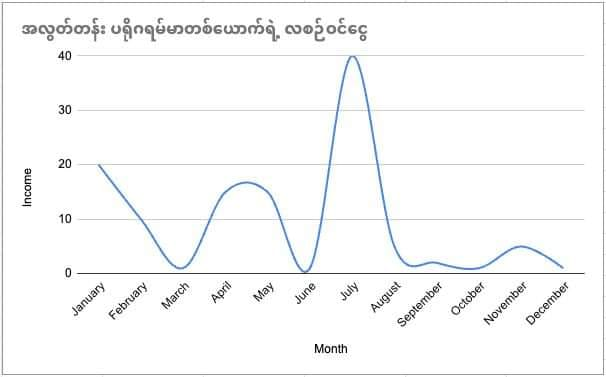

အလွတ်တန်း ပရိုဂရမ်မာလုပ်ပြီး ပိုက်ဆံဘယ်လိုရှာမလဲ?

ဒီနှစ်တွေအတွင်း အလွတ်တန်း ပရိုဂရမ်မာလုပ်ပြီး အပိုဝင်ငွေဘယ်လိုရှာဖြစ်ခဲ့တယ်ဆိုတာလေး ပြန်လည်မျှဝေခြင်းပါ။

## Phase One : ဝါသနာ

အစကတော့ ကုတ်နေရရင်ကို ပျော်နေတာ။
နောက်တော့ ကိုယ်ကုတ်ထားတာလေးကို သူများတွေ သုံးစေချင်လာတယ်။ ပြောရရင် External Validation လိုချင်လာတာမျိုး။ အစွမ်းပြချင်တာမျိုး။ ဟ ဒီကောင်တွေ လုပ်ထားတာ မဆိုးဘူးဆိုတာမျိုး ကြားချင်လာတာနဲ့ ပရိုဂရမ်သေးသေးလေးတွေ စရေးဖြစ်လာတယ်။

ဂဏန်းပေါင်းစက် ကစပြီး ဗေဒင်အလယ် သတင်းဖတ်တာအဆုံး အကုန်လုံးကို App ရေးတယ်။
စစ်စစ်ပေါက်ပေါက် ပြန်တွက်ကြည့်ရင် အမျိုး (၄၀) လောက်ရှိမယ်။

## Phase Two : အသပြာ

အမျိုး (၄၀)​ လောက် ရေးပြီးတဲ့အချိန် အများစု App တွေက user zero နဲ့ Failed သွားတယ်။ တစ်ချို့ App တွေကို သဘောကျတဲ့သူတွေ ရှိလာပြီး အလားတူ App မျိုး ရေးချင်ပါတယ်ဆိုပြီး အခကြေးငွေနဲ့ ကမ်းလှမ်းလာကြတာ ရှိတယ်။ ဒီမှာ မများသော နှုန်းထားနဲ့ အခကြေးငွေယူပြီး စရေးဖြစ်လာတယ်။ ဒါပေမယ့် ရတဲ့ဟာက ဘီယာဖိုးနဲ့ ကုန်တာများတယ် 😃

## Phase Three : ကြော်ညာ

လာအပ်တဲ့ Client တွေက ကြော်ညာနဲ့ ရပ်တည်ကြတာများတယ်။​ ဒီတော့ ကိုယ်လည်း Google Admob နဲ့ အသပြာ ရှာမယ်ဆိုပြီး App တွေရေး၊ ကြော်ညာတွေထည့်၊ စိတ်ကူးတွေယဉ်ပေါ့။ ဒါပေမယ့် တကယ်တမ်း မြန်မာနိုင်ငံကနေ Google Admob နဲ့ ရပ်တည်ဖို့ဆိုတာ နိုင်ငံခြား အဆက်အသွယ်ကောင်းကောင်းလိုတယ်။ ဘဏ်အကောင့်တွေကအစ လိပ်စာ နောက်ပိုင်းဆို ID အဆုံး ထိုင်း / စင်္ကာပူ စတဲ့ နိုင်ငံတွေမှာ ကိုယ့်လူရှိနေမှ ရေရှည် ရပ်တိုင်နိုင်မှာမျိုး။ ရေးတဲ့ App တွေကလည်း 18+ တို့၊ Movie Streaming တို့ စသည်ဖြင့် Google ရဲ့ ပေါ်လစီနဲ့ ငြိတာတွေချည်းပဲ ဆိုတော့ မကြာပါဘူး စိုက်ထားတဲ့ Playstore Developer ဖိုးတွေ၊ ဆာဗာဖိုးတွေ အကုန်ပလုံတော့တာပဲ။ ဘီယာတောင် နပ်မမှန်တော့ဘူးဖြစ်သွားတယ်။ ကိုယ်တွေလည်း intellectual property တွေ copy right တွေအကြောင်း ကောင်းကောင်းမှတ်မိသွားတယ်။ သူများပစ္စည်း (i means intellectural property ) ခိုးမချဖို့ နဲ့ လေးစားဖို့ကို အချိန် နဲ့ ငွေ အများကြီးပေးပြီး သင်လိုက်ရသလိုပါပဲ။

## Phase Four : ရောင်းစား

ကိုယ်က ကြော်ညာ နဲ့ ကိစ္စ ပြတ်ပေမယ့် Client တွေကတော့ နိုင်ငံခြားမှာ နေတဲ့သူတွေ များတာဆိုတော့ အဆင်ပြေကြတယ်။ ဒီတော့ General သုံးလို့ရတဲ့ News Reader တစ်ခု ရေးပြီး ကိုးသောင်း ကိုးထောင် နဲ့ ရောင်းမယ်ဆို လုပ်တယ်။ ဒါလည်း အထိုက်အလျောက်တော့ အိုကေတယ်။ ကောင်းတာတစ်ခုက Local က ကုမ္မဏီတွေ ဆရာသမားတွေနဲ့ ချိတ်ဆက်မိလာတာပဲ။ သူတို့က ငွေအများကြီး မသုံးချင်ဘူး IT နဲ့ ပက်သက်တာတစ်ခု စမ်းပြီး လုပ်ကြည့်ချင်တယ်ဆိုတာမျိုး။ ကိုးသောင်းကိုးထောင်ကို အစပြုပြီး ဆယ်ဂဏန်း ပရောဂျက်တွေ စပြီး ရလာတယ်။

## Phase Five : ပရောဂျက်ရေး

တစ်သိန်း နှစ်သိန်း ပရောဂျက်တွေက ခေါင်းစားရတာနဲ့ မတန်တော့ ဆယ်ဂဏန်း ပရောဂျက်တွေပဲ စပြီးရေးဖြစ်လာတယ်။ ဒါပေမယ့် ပရောဂျက်ဆိုတာ အချိန်မှန် ရတက်တဲ့အမျိုးမဟုတ်ဘူး။​ ထီလိုမျိုးပဲ ရချင်ရမယ် မရတာတော့ များမယ်။ ကိုယ့်ရဲ့ ရှင်သန်ရပ်တည်ရေးကို အထောက်အကူပြုလှတဲ့ အနေအထားအထိ ရောက်မလာ။ အဲ့မှာ တစ်ခုလုပ်ရတယ်။ Yeah, it's လခစား။

### Phase Six : လခစား

ပရောဂျက်တွေ အသည်းအသန်ရှာပြီး Client တွေနဲ့ နပန်းလုံးစရာမလိုတော့ဘူး။ Boss တစ်ယောက် နဲ့တင် ကိစ္စပြီးတယ်။ ပိုက်ဆံတော့ အရင်လို အများကြီးမရပေမယ့် လကုန်တိုင်း အကောင့်ထဲကိုတော့ အသပြာ မှန်မှန်ဝင်တယ်ပေါ့။ ဒီကြားထဲမှာ မျက်နှာနာရမယ့် အသပြာကောင်းကောင်းရမယ့် ပရောဂျက်တွေဆိုရင်တော့ လက်ခံပြီး ရေးဖြစ်တယ်။ တစ်ခါတစ်လေ အဲ့လို side project တွေက တစ်လလောက်ရေးပြီး တစ်နှစ်စာ ဝင်ငွေလောက်ရတော့ လခစား အလုပ်ကိုတောင် ထွက်ဖို့ဖြစ်လာတယ်။

### Phase Seven : အလွတ်တန်း

လခစား အလုပ် နဲ့ side project တွေ တစ်ပြိုင်တည်း ရေးတာက အတော်လေး စိတ်ဖိစီးမှု များပြီး ရတဲ့ အသပြာကိုတောင် enjoy ဖြစ်ဖို့ ခက်လာတယ်။​ နောက် မိသားစုလည်းရှိလာတဲ့အချိန် အလုပ် နဲ့ အသပြာ သာ အဓိက ဆိုတဲ့ mindset မျိုး မရှိတော့ဘူး။ စိတ်အခြေအနေအဆင်ပြေအောင် လခစား အလုပ်ကထွက်။ လက်ခံထားတဲ့ ပရောဂျက်တွေ အကုန်ဖြတ်ပြီး ကိုယ် နဲ့ ကိုယ့်အဖွဲ့အတွက် network နဲ့ skill တိုးတက်ရာ တိုးတက်ကြောင်း ဖြစ်မယ်လို့ ထင်တဲ့ ပရောဂျက်တွေပဲ လိုက်ရှာ / လက်ခံဖြစ်တော့တယ်။ စိတ်အခြေအနေ ကောင်းလာပေမယ့် ငွေရေးကြေးရေးကတော့ အနှုတ်ဘက်ပြတယ်။ "Yeah, everything has come with its own price."

ဒါကတော့ ကျွန်တော်တို့ ကြုံလာရတဲ့ အလွတ်တန်း ပရိုဂရမ်မာ တစ်ယောက်ရဲ့ အကြမ်းဖျဉ်းအခြေအနေပါ။
ရရစားစား နဲ့ ကုတ်ရေးရရင်ကို ပျော်နေတဲ့ အသက်အရွယ်တွေလည်း မဟုတ်တော့ဘူးဆိုတော့ ရှေ့ဆက်ရရင် တကယ့် Business သမားတွေနဲ့ ပေါင်းပြီး Software Business တစ်ခု တူတူတန်တန် ထောင်ဖို့ပဲ ကြံထားပါရဲ့။

Side Note အနေနဲ့

- နတ်မျက်စိ လက်ထောက် ေဗဒင် နဲ့ ထီပေါက် လိုမျိုး Offline App တွေက သုံးတဲ့သူများပြီး တစ်လက USD 50 လောက် ပုံမှန်ရခဲ့ပါတယ်။
- သူများဟာတွေ ခိုးချဖို့ပဲ ကြံမိတာက သင့်ကို smart ဖြစ်စေမှာ မဟုတ်ပါဘူး
- သက်ဆိုင်ရာ ပလက်ဖောင်းတွေရဲ့ Policy ကို အသက်တမျှ ထိမ်းသိမ်းစောင့်ရှောက်ပါ။ Google က တစ်သက်တာ Ban တက်ပါတယ်။ နောက်ပြီး Google နဲ့က ကင်းလို့မရပါဘူး။
- လူတိုင်း သုံးမယ့် App / Product ဆိုတာထက် လူတစ်စုတစ်ဖွဲ့ (ဉပမာ ဆယ်တန်းကျောင်းသား / ကျောင်းသူ တွေ ) အတွက် ရည်ရွယ်ပြီး ရေးတာ ပိုပြီး ထိရောက်ပါတယ်။
- ဘယ်အရာမှ နေ့ချင်းညချင်း ပေါက်တယ်ဆိုတာမျိုး မရှိလို့ အချိန်တစ်ခုရောက်တဲ့အထိ သည်းခံ တောင့်ထားနိုင်မှ အဆင်ပြေမှာပါ။
- Latest Tech တွေကို လေ့လာရတာ သုံးရတာ စိတ်လှုပ်ရှားစရာ ဆိုပေမယ့် တကယ် End User တွေက UI/UX ကိုပဲ အများစုကြည့်ပြီး ဆုံးဖြတ်ကြတာမို ့UI / UX အပိုင်းကို အားစိုက်သင့်ပါတယ်။
- အလကား ဆိုတာ ဘယ်မှာမှ မရှိပါဘူး။ စစချင်းမှာ Free Hosting , Free Blah Blah Blah စသည်ဖြင့် ကုန်းဆင်းအပေါင်း သူတော်ကောင်း လုပ်ချင်ပါတယ်။ ငွေပေးဖို့သာ ပြင်ထားပါ။
- မြန်မာနိုင်ငံမှာဆို အရာရာခက်ခဲတာမို့ နိုင်ငံခြား အသိမိတ်ဆွေ ရှာထားသင့်ပါတယ်။
